# VESC Display

A small dashboard for VESC-based electric vehicles (e-skateboards, e-bikes,
scooters, onewheels). An ESP32 talks to the VESC over UART, reads the live
telemetry and shows speed, battery, power, temperatures, trip data and faults
on a colour TFT.

Built for the **LilyGO TTGO T-Display** (ESP32 + 1.14" 135x240 ST7789), but
the protocol code is board-agnostic and the TFT setup is a few build flags.

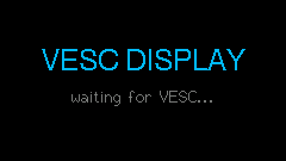

*Rendered by the PC simulator: the real firmware drawing with the real fonts.*

## Screens

Black background, glowing amber digits, teal and cyan accents. The glow is
real: text is blurred at half resolution and added under the frame on every
redraw. Right button = next page, left button = previous page.

| Page      | Shows                                                              |
| --------- | ------------------------------------------------------------------ |
| Main      | Speed in a large digital font with the unit under it, a teal battery bar at the top, trip distance and battery current in the corners, ESC and motor temperature and pack voltage along the bottom with colour coded dots. Faults replace the bottom row with a blinking red line; link loss and low battery pulse. |
| Stats     | ESC, MOTOR, VOLT / POWER, AMPS, AH USED                            |
| Trip      | Distance driven, max speed, Wh per km, Ah used                     |
| G-Force   | Longitudinal g from the change in speed, peak g, and a crosshair whose dot moves up when accelerating and down when braking |
| Battery   | Series cell count, pack and cell voltage, percent, the green / yellow / red cell thresholds and a vertical level bar |
| Settings  | Hold the right button. Brightness, battery series, ESC and motor warning temperature, units, boot animation, page animations, glow effect. Stored in flash. |

All values refresh ten times a second and the screen redraws at 20 fps. On
boot a glowing emblem fades in and out, pages slide in from the side, the
settings open with a spinning gear, bars ease towards their targets. Distance
and Ah counters come from the VESC and reset when it is power cycled. The
G-force page uses no accelerometer: it derives longitudinal acceleration from
the speed, so it cannot show lateral g.

### Buttons

| Action                 | Normal pages     | In settings          |
| ---------------------- | ---------------- | -------------------- |
| Right button, short    | next page        | next row             |
| Left button, short     | previous page    | change the value     |
| Right button, hold     | open settings    | save and close       |

## Hardware

| T-Display pin | VESC          |
| ------------- | ------------- |
| GPIO 26 (RX)  | TX            |
| GPIO 27 (TX)  | RX            |
| GND           | GND           |
| 5V            | 5V (VESC COMM port) |

Any free ESP32 GPIOs work for the UART; change `VESC_RX_PIN` / `VESC_TX_PIN`
in `include/config.h`. The VESC's COMM port is 3.3 V logic, so no level
shifting is needed.

In **VESC Tool** go to *App Settings -> General* and set *App to use* to
`UART` (or `PPM and UART` if you also have a remote on PPM), and set the UART
baud rate to 115200. Write the app configuration.

## Configuration

Edit `include/config.h`:

| Setting               | Meaning                                                     |
| --------------------- | ----------------------------------------------------------- |
| `MOTOR_POLES`         | Magnet poles of the motor (not pole pairs). Usually 14.     |
| `WHEEL_DIAMETER_MM`   | Driven wheel outer diameter.                                |
| `GEAR_RATIO`          | Wheel turns per motor turn. `1.0` for hub motors, `15.0/36.0` for a 15T:36T belt drive. |
| `BATTERY_CELLS`       | Series cell count (10S = 10). Also editable on the display. |
| `USE_IMPERIAL_UNITS`  | `0` for km/h and km, `1` for mph and miles. Also editable on the display. |
| `SPEED_UNIT_LABEL`    | Text next to the speed in metric mode, e.g. `"km/t"`.        |
| `VESC_UART_BAUD`      | Must match the VESC UART app setting.                       |
| `VESC_TIMEOUT_MS`     | Time without data before the display reports a lost link.   |

Battery percentage is derived from pack voltage with a Li-ion discharge
curve, so it reads a little low under heavy load and recovers at rest.
Settings changed on the display are stored in the ESP32's flash and take
precedence over `BATTERY_CELLS` and `USE_IMPERIAL_UNITS` after the first boot.

The glow effect costs roughly 15 ms per frame on the ESP32. If the display
ever feels sluggish, switch *Glow Effect* off in the settings.

## Building and flashing

Requires [PlatformIO](https://platformio.org/) (`pip install platformio`).

```sh
pio run -e tdisplay              # build
pio run -e tdisplay -t upload    # flash over USB
pio device monitor               # serial log at 115200 baud
```

The serial log prints one telemetry line per second, which is handy for
checking the UART link before the screen is wired up.

## Tests

The protocol library has host-side unit tests (framing, CRC, `COMM_GET_VALUES`
decoding, speed / distance / battery maths):

```sh
pio test -e native
```

## Testing on a PC, no hardware needed

The whole firmware runs on a desktop. `src/sim` contains stand-ins for the
Arduino runtime and for TFT_eSPI (using the original TFT_eSPI fonts, so text
is pixel identical), plus a fake VESC that answers `COMM_GET_VALUES` with a
scripted ride: boot without a VESC, accelerate, cruise, brake with regen,
flick through the pages, open the settings and change two of them, throw an
`OVER_TEMP_FET` fault, run the battery low, lose the link.

```sh
pip install pillow
python3 tools/run_sim.py --open
```

That compiles the simulator with whatever C++ compiler is on the PATH (or
PlatformIO if none is), plays the ride, and writes `sim_out/demo.gif` and one
PNG per page. Change something in `src/Dashboard.cpp`, run it again, look.

| Boot | Main |
| ---- | ---- |
|  | 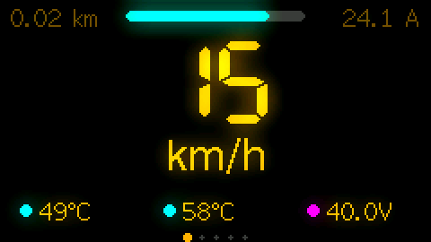 |

| Stats | Trip |
| ----- | ---- |
| 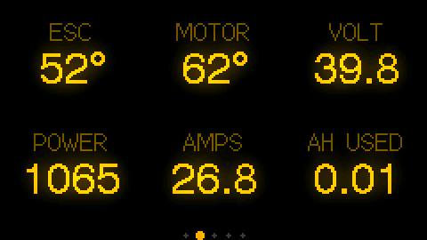 | 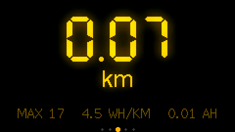 |

| G-Force | Battery |
| ------- | ------- |
| 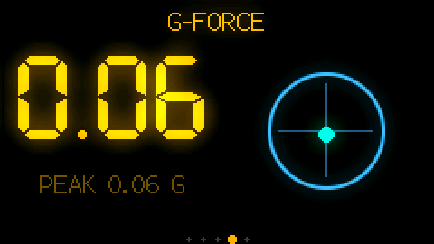 | 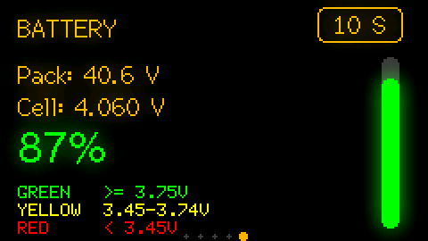 |

| Settings | Settings, page 2 |
| -------- | ---------------- |
| 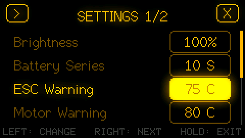 | 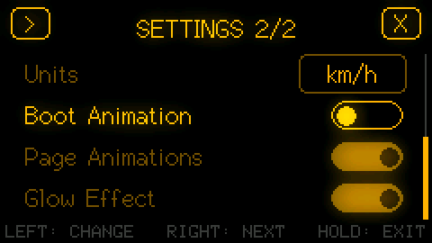 |

| Fault | Low battery | Link lost |
| ----- | ----------- | --------- |
| 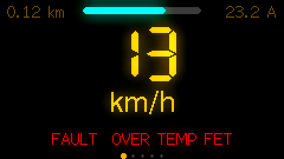 | 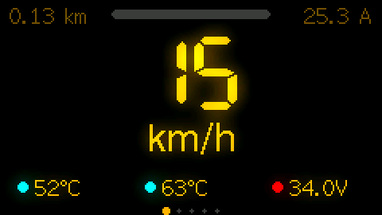 | 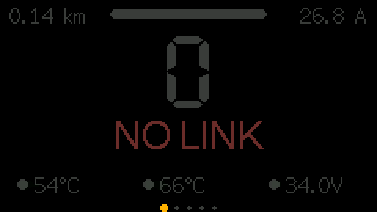 |

### Fully automatic: GitHub Actions

Every push runs `.github/workflows/ci.yml`, which:

1. runs the protocol unit tests,
2. compiles the ESP32 firmware and uploads `firmware.bin` as an artifact,
3. builds and runs the PC simulator and uploads the demo GIF and page PNGs.

Open the *Actions* tab on GitHub, pick the latest run, and download the
artifacts. No tools need to be installed locally.

## Bench testing with a real board but no VESC

`tools/vesc_sim.py` pretends to be a VESC on a USB-serial adapter and plays a
synthetic ride (accelerate, cruise, brake with regen, stop) with a slowly
draining battery:

```sh
pip install pyserial
python3 tools/vesc_sim.py /dev/ttyUSB1            # metric, no fault
python3 tools/vesc_sim.py /dev/ttyUSB1 --fault 5  # report OVER_TEMP_FET
```

Cross the adapter's TX/RX with the display's `VESC_RX_PIN` / `VESC_TX_PIN`.

## Project layout

```
include/config.h          vehicle, wiring and unit settings
lib/VescUart/             VESC UART protocol (host-testable, no Arduino deps)
  VescPacket.*            frame encode/decode, CRC-16
  VescValues.*            COMM_GET_VALUES decoder, fault names
  VescMath.*              ERPM -> speed, tachometer -> distance, battery %
  VescUart.*              Arduino Stream client that polls the VESC
src/Dashboard.*           TFT_eSPI dashboard renderer with the glow pipeline
src/Settings.*            settings model, stored in flash with Preferences
src/main.cpp              firmware entry point, buttons, settings, polling loop
src/sim/                  PC simulator: Arduino + TFT_eSPI stand-ins, fake VESC
test/test_protocol/       Unity tests for the protocol library
tools/run_sim.py          one-command PC test: build, simulate, make GIF
tools/vesc_sim.py         fake VESC over USB-serial for bench testing a real board
.github/workflows/ci.yml  tests, firmware build and simulator demo on every push
```

## Adapting to another board or screen

* Different ESP32 board with the same ST7789 panel: change the `TFT_*` pin
  defines in `platformio.ini`.
* Different panel supported by TFT_eSPI: swap `-DST7789_DRIVER` for the right
  driver and adjust `TFT_WIDTH` / `TFT_HEIGHT`. The layout assumes a 240x135
  landscape canvas; other sizes will need adjustments in `src/Dashboard.cpp`.
* Something other than TFT_eSPI (e.g. an OLED): reimplement `Dashboard`; the
  `DashboardState` struct already holds every number in display units.

## Protocol notes

The VESC UART protocol frames every message as
`[2][len][payload][crc16 hi][crc16 lo][3]` (a `3` start byte and 16-bit
length for payloads over 255 bytes). The CRC is CRC-16/XMODEM over the
payload. The display sends `COMM_GET_VALUES` (id 4) ten times a second and
decodes the big-endian fixed-point reply as laid out in `commands.c` of the
VESC firmware. Fields added by newer firmware (per-MOSFET temperatures, Vd/Vq,
status) are decoded when present, so firmware 3.x through 6.x all work.
